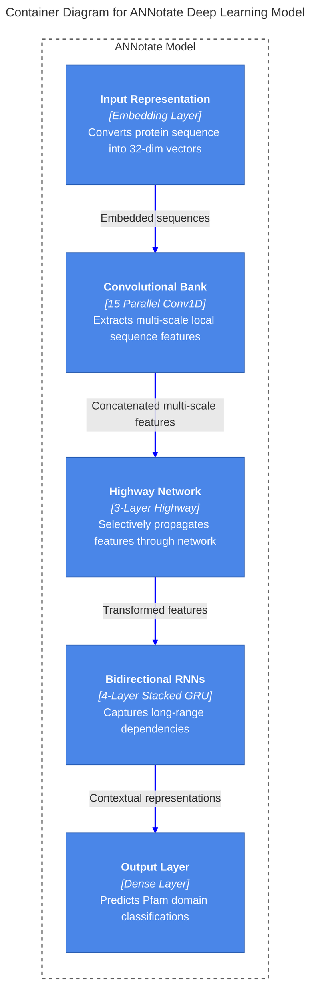

# ANNotate

### Protein sequence annotation using artificial neural networks

# Setup Environment

1. Follow official TensorFlow docs and make sure the required GPU drivers and libraries are installed and working.

    - https://www.tensorflow.org/install/gpu

2. Install Python 3.7

    - (Optional) Setup python virtual environment
        ```ps
        py -3.7 -m venv $Env:USERPROFILE\venv\tf37
        & "$Env:USERPROFILE\venv\tf37\Scripts\Activate.ps1"
        ```

3. Install Python libraries

    - `pip install -r requirements.txt`

    - This installs the following libraries and its dependencies:
        ```
        tensorflow-gpu>=1.11
        colorama>=0.3.9
        coloredlogs>=10.0
        msgpack>=0.5.6
        tqdm>=4.26.0
        ujson>=1.35
        ```

# Download and Build the Pfam Regions Dataset

`python datasets/pfam_regions_build.py`

## Features

-   Preprocess uniprot FASTA and regions TSV files into TFRECORDS files suitable for training:

    1. Training Set: `pfam-regions-train.tfrecords`
    2. Testing Set: `pfam-regions-test.tfrecords`
    3. Metadata: `pfam-regions-meta.json`

-   Downloads uniprot FASTA and regions TSV files from the pfam FTP server into DATASET_DIR if those files don't already exist.

-   Intermediate data are cached in MSGPACK files to speed up future builds with different arguments.

-   Configure the fraction of sequences to be include in the testing set, default is 0.2 (20%).

-   Option to Include only the top N domain classes in the dataset file, includes all domains by default.

-   Option to limit the number of sequences to include in the training and/or testing sets, default is no limit.

## Arguments

```
optional arguments:
  -h, --help            show this help message and exit
  -n NUM_CLASSES, --num_classes NUM_CLASSES
                        Include only the top N domain classes in the dataset
                        file, include all domain classes if None.
  -s TEST_SPLIT, --test_split TEST_SPLIT
                        Fraction of the dataset to be used as test data,
                        default is 0.2.
  -t MAX_SEQ_PER_CLASS_IN_TRAIN, --max_seq_per_class_in_train MAX_SEQ_PER_CLASS_IN_TRAIN
                        Maximum the number of sequences to include in the
                        training datasets, default is no limit.
  -e MAX_SEQ_PER_CLASS_IN_TEST, --max_seq_per_class_in_test MAX_SEQ_PER_CLASS_IN_TEST
                        Maximum the number of sequences to include in the
                        testing datasets, default is no limit.
  -d DATASET_DIR, --dataset_dir DATASET_DIR
                        Location to store dataset files, default is ~/datasets.
```

## Examples

-   Build full dataset with 20% test split, and store files at ~/datasets

    `python datasets/pfam_regions_build.py`

-   Build 10 class dataset with 20% test split, and store files at ~/datasets

    `python datasets/pfam_regions_build.py --num_classes=10 --test_split=0.2 --dataset_dir=~/dataset`

-   Build a toy dataset that can finish in 750 steps (300 sec) - 3 sequence/class

    `python datasets/pfam_regions_build.py -t 3 -e 3 -d ~/datasets`

-   Build a toy dataset that can finish in 300 steps (120 sec) - 2 sequence/class

    `python datasets/pfam_regions_build.py -t 2 -e 2 -d ~/datasets`

-   Build a toy dataset that can finish in 40 steps (20 sec) - 1 sequence/class - 4000 classes

    `python datasets/pfam_regions_build.py -n 4000 -t 1 -e 1 -d ~/datasets`

# Train modal

`python models/pfam-regions/v5-BiRnn.py`

## Train with 10 class dataset, using batch size of 64

`python models/pfam-regions/v5-BiRnn.py --training_data=/home/user/datasets/pfam-regions-d10-s20-train.tfrecords --eval_data=/home/user/datasets/pfam-regions-d10-s20-test.tfrecords --model_dir=./checkpoints/d10-v1 --batch_size=64`

## Train with full dataset, using batch size of 4

`python models/pfam-regions/v5-BiRnn.py --training_data=/home/user/datasets/pfam-regions-d0-s20-train.tfrecords --eval_data=/home/user/datasets/pfam-regions-d0-s20-test.tfrecords --model_dir=./checkpoints/d0-v1 --num_classes=16715 --batch_size=4`

# DEBUG

```python
# checkpoint averaging
import re
from collections import OrderedDict
import tensorflow as tf
tf.enable_eager_execution()
tf.config.experimental.set_memory_growth(tf.config.experimental.list_physical_devices('GPU')[0], True)
import numpy as np
import functools
import json
from pathlib import Path
batch_size = 4
tf.ones((batch_size, 1), dtype=tf.int32)
batch_size, sequence_length, num_classes = (2, 6, 32)
lengths = tf.random.uniform([batch_size],minval=2,maxval=sequence_length,dtype=tf.int32)
mask = tf.sequence_mask(lengths=lengths, maxlen=sequence_length, dtype=tf.float32)
logits = tf.random.uniform([batch_size, 1, sequence_length],maxval=num_classes,dtype=tf.int32)
# checkpoint debug
from tensorflow.python import pywrap_tensorflow

reader = pywrap_tensorflow.NewCheckpointReader('/data12/checkpoints/goa-20191015-v2/goa-v2/gru512x2-tf2048x2-ff1024-dd20-lr6_goa_TITANRTX_8086K1-2.2/step-1314779')
var_to_shape_map = reader.get_variable_to_shape_map()
# transformer beam decode
batch_size, length, embedding_size = (2, 3, 5)
decoder_inputs = tf.random.uniform([batch_size, length, embedding_size],minval=2,maxval=10,dtype=tf.int32)
```

# Tensorboard

```bash
source /opt/intel/parallel_studio_xe_2019/bin/psxevars.sh
source ~/venv/tf15/bin/activate
# 2650v1
/home/hotdogee/venv/tf15/bin/python /home/hotdogee/build/tb-hotdogee/bazel-bin/tensorboard/tensorboard --logdir /data12/checkpoints/do-20191101-v1-seq2seq/do-v1-cafa --port 6022 --samples_per_plugin=scalars=1000

```

# Install Rosetta

https://www.rosettacommons.org/software/license-and-download
Username: Academic_User
Password: Xry3x4
https://www.rosettacommons.org/demos/latest/tutorials/install_build/install_build

```bash
sudo apt install -y zlib1g-dev scons build-essential
cd ~/build
# download rosetta_src_3.12_bundle.tgz
tar -xvzf rosetta_src_3.12_bundle.tgz
mv rosetta_src_2020.08.61146_bundle rosetta
cd ~/build/rosetta/main/source/
./scons.py -j 24 mode=release extras=opencl bin
# binaries are located in ~/build/rosetta/main/source/bin/
```

# Install PyRosetta

http://www.pyrosetta.org/dow
Username: levinthal
Password: paradox
https://graylab.jhu.edu/pyrosetta/downloads/documentation/PyRosetta_Install_Tutorial.pdf

```bash
cd ~/build
# download PyRosetta4.Release.python37.ubuntu.release-255.tar.bz2
tar -xvjf PyRosetta4.Release.python37.ubuntu.release-255.tar.bz2
source ~/venv/casp/bin/activate
python PyRosetta4.Release.python37.ubuntu.release-255/setup/setup.py install
```
# ANNotate Deep Learning Model Architecture

## Overview

ANNotate is a deep learning model designed for protein sequence functional annotation, specifically for predicting Pfam domains. The model employs a hierarchical architecture that combines convolutional and recurrent neural networks to capture both local amino acid patterns and long-range dependencies in protein sequences.The complete architecture is implemented in `v4-BiRnn-tf2.py` and consists of the following components:

## Input Representation

- **Input Layer**: Accepts variable-length protein sequences encoded as integers
- **Amino Acid Vocabulary**: 28 characters including 20 standard amino acids and special characters
- **Input Encoding**: One-hot encoding of protein sequences
- **Embedding**: 32-dimensional continuous vector space (896 parameters)
- **Dropout**: 20% dropout applied to embeddings for regularization

## Multi-Scale Convolutional Feature Extraction

The model uses a convolutional bank to detect sequence patterns at multiple resolutions:

- **Parallel Convolutions**: 15 parallel 1D convolutional layers with increasing kernel sizes
- **Kernel Sizes**: Odd sizes from 1 to 29 amino acids
- **Filters**: 32 filters per convolutional layer with 'same' padding
- **Parameter Count**: ~205,400 parameters in convolutional layers
- **Feature Concatenation**: Outputs from all convolutional layers are concatenated (480 features)

## Normalization and Activation

- **Batch Normalization**: Applied after concatenation to stabilize training
- **Activation**: ReLU activation function
- **Dropout**: 20% dropout applied to convolutional features

## Highway Network

A 3-layer highway network enables the model to selectively propagate features:

- **Structure**: 3 stacked highway layers
- **Units**: 512 units per layer
- **Gating Mechanism**: Transform gates with sigmoid activation and bias initialized to -1.0
- **Highway Connections**: Allow information to flow through either transformed path or identity path
- **Parameter Count**: ~1,575,936 parameters in highway network

## Bidirectional Recurrent Layers

To capture long-range dependencies in protein sequences:

- **Structure**: 4 stacked bidirectional GRU layers
- **Units**: 512 units in each direction (1024 total features)
- **Bidirectional Processing**: Sequences processed in both forward and reverse directions
- **Context Integration**: Incorporates information from both preceding and following amino acids
- **Parameter Count**: ~12,607,488 parameters in recurrent layers

## Output Layer

- **Dense Layer**: Fully-connected layer with 16,714 units (number of Pfam domain classes)
- **No Activation**: Raw logits output for use with cross-entropy loss
- **Parameter Count**: ~17,131,850 parameters in output layer

## Training Configuration

- **Loss Function**: Masked categorical cross-entropy to handle variable-length sequences
- **Optimizer**: Stochastic gradient descent with momentum (0.9)
- **Learning Rate**: Exponential learning rate schedule with warmup
- **Regularization**: Dropout layers and batch normalization to prevent overfitting
- **Batch Size**: Dynamic batching based on sequence length buckets

## Model Statistics

- **Total Parameters**: 31,552,106 (~120.36 MB)
- **Trainable Parameters**: 31,549,098 (~120.35 MB)
- **Non-trainable Parameters**: 3,008 (~11.75 KB)

## Model Innovations

1. **Multi-scale Convolution Bank**: Captures local sequence motifs at different resolutions simultaneously
2. **Highway Network**: Facilitates gradient flow through deep networks with learned gating
3. **Stacked Bidirectional GRUs**: Effectively models long-range dependencies in both directions
4. **Dynamic Sequence Handling**: Efficiently processes variable-length protein sequences through bucketing

This architecture is specifically optimized for protein sequence analysis, balancing the ability to detect local amino acid patterns through convolutions while capturing long-range dependencies through recurrent layers. 

### Deep Learning Architecture for Protein Sequence Annotation

I developed a deep learning model for protein sequence annotation based on a hierarchical architecture that combines convolutional and recurrent neural networks. The model architecture was specifically designed to capture both local amino acid patterns and long-range dependencies in protein sequences.

#### Model Architecture

The model employs a multi-scale approach for feature extraction from protein sequences. Input protein sequences were encoded using one-hot encoding and embedded into a 32-dimensional continuous vector space. To capture local sequence motifs of varying lengths, I implemented a convolutional bank comprising 15 parallel convolutional layers with increasing kernel sizes (from 1 to 29 amino acids), each using 32 filters with 'same' padding. This multi-scale convolutional bank enables the model to detect sequence patterns at different resolutions simultaneously.

The convolutional features were normalized using batch normalization followed by ReLU activation. To facilitate gradient flow through the deep network, I incorporated a 3-layer highway network (Srivastava et al., 2015) with 512 units per layer. The highway network allows the model to selectively propagate features through the network using learned gating mechanisms.

For capturing long-range dependencies and context within the protein sequences, I employed four stacked bidirectional Gated Recurrent Unit (GRU) layers (Cho et al., 2014) with 512 units in each direction. The bidirectional approach processes the sequence in both forward and reverse directions, enabling the model to incorporate context from both preceding and following amino acids at each position. A final batch normalization layer was applied to the recurrent outputs before classification.

The output layer consists of a fully-connected layer with 16,714 units corresponding to the number of Pfam domain classes in my dataset. During training, I employed masked categorical cross-entropy loss to handle variable-length sequences and focus the learning on actual protein regions while ignoring padding.

#### Training

I trained the model using stochastic gradient descent with momentum (0.9) and an exponential learning rate schedule with warmup. I employed a batch size of 1 and dynamic bucketing to efficiently handle variable-length sequences. To prevent overfitting, I applied dropout (0.2) after both the embedding and convolutional layers. The model was implemented in TensorFlow 2.19 and trained on NVIDIA TITAN V.

The total model size is approximately 31.55 million parameters (120.35 MB), with the recurrent layers and output classification layer constituting the majority of the parameters.

## Model Summary

Model: "Pfam_BiRNN_Model"

```
┏━━━━━━━━━━━━━━━━━━━━━━━━━━━━━━━━┳━━━━━━━━━━━━━━━━━━━━━━━━━━━┳━━━━━━━━━━━━━━━━━┳━━━━━━━━━━━━━━━━━━━━━━━━━━━━━━━━┓
┃ Layer (type)                   ┃ Output Shape              ┃         Param # ┃ Connected to                   ┃
┡━━━━━━━━━━━━━━━━━━━━━━━━━━━━━━━━╇━━━━━━━━━━━━━━━━━━━━━━━━━━━╇━━━━━━━━━━━━━━━━━╇━━━━━━━━━━━━━━━━━━━━━━━━━━━━━━━━┩
│ protein (InputLayer)           │ (None, None)              │               0 │ -                              │
├────────────────────────────────┼───────────────────────────┼─────────────────┼────────────────────────────────┤
│ embedding (Embedding)          │ (None, None, 32)          │             896 │ protein[0][0]                  │
├────────────────────────────────┼───────────────────────────┼─────────────────┼────────────────────────────────┤
│ dropout (Dropout)              │ (None, None, 32)          │               0 │ embedding[0][0]                │
├────────────────────────────────┼───────────────────────────┼─────────────────┼────────────────────────────────┤
│ conv1d_bank_1 (Conv1D)         │ (None, None, 32)          │           1,024 │ dropout[0][0]                  │
├────────────────────────────────┼───────────────────────────┼─────────────────┼────────────────────────────────┤
│ conv1d_bank_3 (Conv1D)         │ (None, None, 32)          │           3,072 │ dropout[0][0]                  │
├────────────────────────────────┼───────────────────────────┼─────────────────┼────────────────────────────────┤
│ conv1d_bank_5 (Conv1D)         │ (None, None, 32)          │           5,120 │ dropout[0][0]                  │
├────────────────────────────────┼───────────────────────────┼─────────────────┼────────────────────────────────┤
│ conv1d_bank_7 (Conv1D)         │ (None, None, 32)          │           7,168 │ dropout[0][0]                  │
├────────────────────────────────┼───────────────────────────┼─────────────────┼────────────────────────────────┤
│ conv1d_bank_9 (Conv1D)         │ (None, None, 32)          │           9,216 │ dropout[0][0]                  │
├────────────────────────────────┼───────────────────────────┼─────────────────┼────────────────────────────────┤
│ conv1d_bank_11 (Conv1D)        │ (None, None, 32)          │          11,264 │ dropout[0][0]                  │
├────────────────────────────────┼───────────────────────────┼─────────────────┼────────────────────────────────┤
│ conv1d_bank_13 (Conv1D)        │ (None, None, 32)          │          13,312 │ dropout[0][0]                  │
├────────────────────────────────┼───────────────────────────┼─────────────────┼────────────────────────────────┤
│ conv1d_bank_15 (Conv1D)        │ (None, None, 32)          │          15,360 │ dropout[0][0]                  │
├────────────────────────────────┼───────────────────────────┼─────────────────┼────────────────────────────────┤
│ conv1d_bank_17 (Conv1D)        │ (None, None, 32)          │          17,408 │ dropout[0][0]                  │
├────────────────────────────────┼───────────────────────────┼─────────────────┼────────────────────────────────┤
│ conv1d_bank_19 (Conv1D)        │ (None, None, 32)          │          19,456 │ dropout[0][0]                  │
├────────────────────────────────┼───────────────────────────┼─────────────────┼────────────────────────────────┤
│ conv1d_bank_21 (Conv1D)        │ (None, None, 32)          │          21,504 │ dropout[0][0]                  │
├────────────────────────────────┼───────────────────────────┼─────────────────┼────────────────────────────────┤
│ conv1d_bank_23 (Conv1D)        │ (None, None, 32)          │          23,552 │ dropout[0][0]                  │
├────────────────────────────────┼───────────────────────────┼─────────────────┼────────────────────────────────┤
│ conv1d_bank_25 (Conv1D)        │ (None, None, 32)          │          25,600 │ dropout[0][0]                  │
├────────────────────────────────┼───────────────────────────┼─────────────────┼────────────────────────────────┤
│ conv1d_bank_27 (Conv1D)        │ (None, None, 32)          │          27,648 │ dropout[0][0]                  │
├────────────────────────────────┼───────────────────────────┼─────────────────┼────────────────────────────────┤
│ conv1d_bank_29 (Conv1D)        │ (None, None, 32)          │          29,696 │ dropout[0][0]                  │
├────────────────────────────────┼───────────────────────────┼─────────────────┼────────────────────────────────┤
│ concatenate (Concatenate)      │ (None, None, 480)         │               0 │ conv1d_bank_1[0][0],           │
│                                │                           │                 │ conv1d_bank_3[0][0],           │
│                                │                           │                 │ conv1d_bank_5[0][0],           │
│                                │                           │                 │ conv1d_bank_7[0][0],           │
│                                │                           │                 │ conv1d_bank_9[0][0],           │
│                                │                           │                 │ conv1d_bank_11[0][0],          │
│                                │                           │                 │ conv1d_bank_13[0][0],          │
│                                │                           │                 │ conv1d_bank_15[0][0],          │
│                                │                           │                 │ conv1d_bank_17[0][0],          │
│                                │                           │                 │ conv1d_bank_19[0][0],          │
│                                │                           │                 │ conv1d_bank_21[0][0],          │
│                                │                           │                 │ conv1d_bank_23[0][0],          │
│                                │                           │                 │ conv1d_bank_25[0][0],          │
│                                │                           │                 │ conv1d_bank_27[0][0],          │
│                                │                           │                 │ conv1d_bank_29[0][0]           │
├────────────────────────────────┼───────────────────────────┼─────────────────┼────────────────────────────────┤
│ batch_normalization            │ (None, None, 480)         │           1,440 │ concatenate[0][0]              │
│ (BatchNormalization)           │                           │                 │                                │
├────────────────────────────────┼───────────────────────────┼─────────────────┼────────────────────────────────┤
│ relu (Activation)              │ (None, None, 480)         │               0 │ batch_normalization[0][0]      │
├────────────────────────────────┼───────────────────────────┼─────────────────┼────────────────────────────────┤
│ dropout_1 (Dropout)            │ (None, None, 480)         │               0 │ relu[0][0]                     │
├────────────────────────────────┼───────────────────────────┼─────────────────┼────────────────────────────────┤
│ concatenate_1 (Concatenate)    │ (None, None, 512)         │               0 │ dropout_1[0][0],               │
│                                │                           │                 │ dropout[0][0]                  │
├────────────────────────────────┼───────────────────────────┼─────────────────┼────────────────────────────────┤
│ T_0 (Dense)                    │ (None, None, 512)         │         262,656 │ concatenate_1[0][0]            │
├────────────────────────────────┼───────────────────────────┼─────────────────┼────────────────────────────────┤
│ H_0 (Dense)                    │ (None, None, 512)         │         262,656 │ concatenate_1[0][0]            │
├────────────────────────────────┼───────────────────────────┼─────────────────┼────────────────────────────────┤
│ highway_0                      │ (None, None, 512)         │               0 │ T_0[0][0], H_0[0][0],          │
│ (HighwayGatingLayer)           │                           │                 │ concatenate_1[0][0]            │
├────────────────────────────────┼───────────────────────────┼─────────────────┼────────────────────────────────┤
│ T_1 (Dense)                    │ (None, None, 512)         │         262,656 │ highway_0[0][0]                │
├────────────────────────────────┼───────────────────────────┼─────────────────┼────────────────────────────────┤
│ H_1 (Dense)                    │ (None, None, 512)         │         262,656 │ highway_0[0][0]                │
├────────────────────────────────┼───────────────────────────┼─────────────────┼────────────────────────────────┤
│ highway_1                      │ (None, None, 512)         │               0 │ T_1[0][0], H_1[0][0],          │
│ (HighwayGatingLayer)           │                           │                 │ highway_0[0][0]                │
├────────────────────────────────┼───────────────────────────┼─────────────────┼────────────────────────────────┤
│ T_2 (Dense)                    │ (None, None, 512)         │         262,656 │ highway_1[0][0]                │
├────────────────────────────────┼───────────────────────────┼─────────────────┼────────────────────────────────┤
│ H_2 (Dense)                    │ (None, None, 512)         │         262,656 │ highway_1[0][0]                │
├────────────────────────────────┼───────────────────────────┼─────────────────┼────────────────────────────────┤
│ highway_2                      │ (None, None, 512)         │               0 │ T_2[0][0], H_2[0][0],          │
│ (HighwayGatingLayer)           │                           │                 │ highway_1[0][0]                │
├────────────────────────────────┼───────────────────────────┼─────────────────┼────────────────────────────────┤
│ bidirectional_quad_stacked_gru │ (None, None, 1024)        │      12,607,488 │ highway_2[0][0]                │
│ (Bidirectional)                │                           │                 │                                │
├────────────────────────────────┼───────────────────────────┼─────────────────┼────────────────────────────────┤
│ batch_normalization_1          │ (None, None, 1024)        │           4,096 │ bidirectional_quad_stacked_gru │
│ (BatchNormalization)           │                           │                 │                                │
├────────────────────────────────┼───────────────────────────┼─────────────────┼────────────────────────────────┤
│ logits (Dense)                 │ (None, None, 16714)       │      17,131,850 │ batch_normalization_1[0][0]    │
└────────────────────────────────┴───────────────────────────┴─────────────────┴────────────────────────────────┘
```

Total params: 31,552,106 (120.36 MB)
Trainable params: 31,549,098 (120.35 MB)
Non-trainable params: 3,008 (11.75 KB)

## Architecture Diagrams

### Container Diagram



### Component Diagram

```mermaid
---
title: Component Diagram for ANNotate Model Architecture
---
flowchart TD
    %% Main components
    input["Protein Sequence<br/>Input Layer"] --> embed["Embedding<br/>32-dim vectors"]
    embed --> dropout1["Dropout 20%"]
    
    %% Convolutional Bank subgraph - using a grid layout with invisible connections
    subgraph convbank["Convolutional Bank"]
        %% First row
        conv1["Conv1D<br/>k=1, 32 Filters"]
        conv3["Conv1D<br/>k=3, 32 Filters"]
        conv5["Conv1D<br/>k=5, 32 Filters"]
        conv7["Conv1D<br/>k=7, 32 Filters"]
        conv9["Conv1D<br/>k=9, 32 Filters"]
        
        %% Second row
        conv11["Conv1D<br/>k=11, 32 Filters"]
        conv13["Conv1D<br/>k=13, 32 Filters"]
        conv15["Conv1D<br/>k=15, 32 Filters"]
        conv17["Conv1D<br/>k=17, 32 Filters"]
        conv19["Conv1D<br/>k=19, 32 Filters"]
        
        %% Third row
        conv21["Conv1D<br/>k=21, 32 Filters"]
        conv23["Conv1D<br/>k=23, 32 Filters"]
        conv25["Conv1D<br/>k=25, 32 Filters"]
        conv27["Conv1D<br/>k=27, 32 Filters"]
        conv29["Conv1D<br/>k=29, 32 Filters"]
        
        %% Vertical connections for grid layout
        conv1 --- conv11 --- conv21
        conv3 --- conv13 --- conv23
        conv5 --- conv15 --- conv25
        conv7 --- conv17 --- conv27
        conv9 --- conv19 --- conv29
    end
    
    dropout1 --> convbank
    
    %% Post conv processing
    convbank --> concat["Concatenate"]
    concat --> batchnorm1["Batch Normalization"]
    batchnorm1 --> relu["ReLU Activation"]
    relu --> dropout2["Dropout 20%"]
    dropout2 --> res["Residual Connection"]
    %% Add residual connection from dropout1 to concat (showing the concatenation of embedded inputs with conv outputs)
    dropout1 --> res
    
    %% Highway Network subgraph
    subgraph highway["Highway Network"]
        hw1["Highway Layer 1<br/>512 units"]
        hw2["Highway Layer 2<br/>512 units"]
        hw3["Highway Layer 3<br/>512 units"]
        
        hw1 --> hw2 --> hw3
    end
    
    res --> highway
    
    %% Bidirectional RNN subgraph
    subgraph birnn["Bidirectional RNN"]
        gru1["BiGRU Layer 1<br/>512+512 units"]
        gru2["BiGRU Layer 2<br/>512+512 units"]
        gru3["BiGRU Layer 3<br/>512+512 units"]
        gru4["BiGRU Layer 4<br/>512+512 units"]
        
        gru1 --> gru2 --> gru3 --> gru4
    end
    
    highway --> birnn
    birnn --> batchnorm2["Batch Normalization"]
    batchnorm2 --> dense["Dense<br/>16,714 Pfam domain classes"]
    dense --> output["Output Layer<br/>Pfam domain probabilities<br/>for each amino acid<br/>in the sequence"]
    
    %% Node styling
    %% style input fill:#e8f4f8,stroke:#5b9bd5,color:black
    style embed fill:#e8f4f8,stroke:#5b9bd5,color:black
    style dropout1 fill:#e8f4f8,stroke:#5b9bd5,color:black
    style concat fill:#e8f4f8,stroke:#5b9bd5,color:black
    style batchnorm1 fill:#e8f4f8,stroke:#5b9bd5,color:black
    style relu fill:#e8f4f8,stroke:#5b9bd5,color:black
    style dropout2 fill:#e8f4f8,stroke:#5b9bd5,color:black
    style res fill:#e8f4f8,stroke:#5b9bd5,color:black
    style batchnorm2 fill:#e8f4f8,stroke:#5b9bd5,color:black
    style dense fill:#e8f4f8,stroke:#5b9bd5,color:black
    
    %% Style for all conv layers
    style conv1 fill:#e8f4f8,stroke:#5b9bd5,color:black
    style conv3 fill:#e8f4f8,stroke:#5b9bd5,color:black
    style conv5 fill:#e8f4f8,stroke:#5b9bd5,color:black
    style conv7 fill:#e8f4f8,stroke:#5b9bd5,color:black
    style conv9 fill:#e8f4f8,stroke:#5b9bd5,color:black
    style conv11 fill:#e8f4f8,stroke:#5b9bd5,color:black
    style conv13 fill:#e8f4f8,stroke:#5b9bd5,color:black
    style conv15 fill:#e8f4f8,stroke:#5b9bd5,color:black
    style conv17 fill:#e8f4f8,stroke:#5b9bd5,color:black
    style conv19 fill:#e8f4f8,stroke:#5b9bd5,color:black
    style conv21 fill:#e8f4f8,stroke:#5b9bd5,color:black
    style conv23 fill:#e8f4f8,stroke:#5b9bd5,color:black
    style conv25 fill:#e8f4f8,stroke:#5b9bd5,color:black
    style conv27 fill:#e8f4f8,stroke:#5b9bd5,color:black
    style conv29 fill:#e8f4f8,stroke:#5b9bd5,color:black
    
    style hw1 fill:#e8f4f8,stroke:#5b9bd5,color:black
    style hw2 fill:#e8f4f8,stroke:#5b9bd5,color:black
    style hw3 fill:#e8f4f8,stroke:#5b9bd5,color:black
    
    style gru1 fill:#e8f4f8,stroke:#5b9bd5,color:black
    style gru2 fill:#e8f4f8,stroke:#5b9bd5,color:black
    style gru3 fill:#e8f4f8,stroke:#5b9bd5,color:black
    style gru4 fill:#e8f4f8,stroke:#5b9bd5,color:black
    
    %% Subgraph styling
    style convbank fill:#f8f4e8,stroke:#ff9900,color:black
    style highway fill:#f8f4e8,stroke:#ff9900,color:black
    style birnn fill:#f8f4e8,stroke:#ff9900,color:black
    
    %% Connection styling
    linkStyle default stroke:#5b9bd5,stroke-width:2px
    
    %% Make all connections inside convolutional bank invisible
    %% The 2-11 links are the grid connections in the convbank
    linkStyle 2,3,4,5,6,7,8,9,10,11 stroke-opacity:0.0
```

